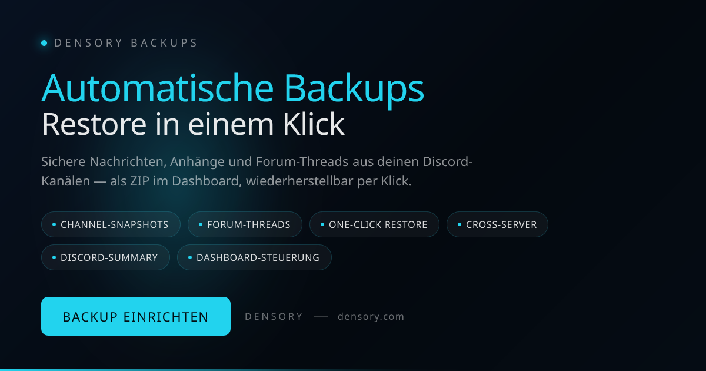

# Densory Backups — Backup & Wiederherstellung

 

> Schlaf ruhiger — deine wichtigsten Kanäle werden automatisch gesichert, inklusive Anhänge und Forum-Threads.

Densory Backups archiviert Text- und Forum-Kanäle im Hintergrund: Nachrichten, Dateien, Embeds und Threads landen als durchsuchbare Snapshots in deinem Dashboard. Wenn etwas schiefgeht, startest du die Wiederherstellung per Klick — auch auf einem anderen Server, mit originalgetreuen Autorennamen.

### 🛒 Im Densory-Shop erhältlich

**[Densory Backups — Im Shop ansehen](https://densory.com/shop/densory-backups)**

## Funktionen

- **Channel-Snapshots** — Text- und Forum-Kanäle — Nachrichten, Dateien und Embeds automatisch archiviert.
- **Forum-Threads** — Threads inklusive Metadaten — nicht nur Top-Level-Nachrichten.
- **One-Click Restore** — Snapshot wählen, Zielkanal setzen — auch auf einem anderen Server.
- **Cross-Server** — Community-Archiv beim Umzug mitnehmen — originalgetreue Autorennamen.
- **Discord-Summary** — Backup fertig? Zusammenfassung direkt als Embed in deinem Log-Kanal.
- **Dashboard-Steuerung** — Kanäle, Intervall und Rhythmus zentral konfiguriert — ohne Bot-Commands.

## Voraussetzungen

- Discord-Bot mit Zugriff auf die zu sichernden Kanäle
- Bot-Host mit ausreichend Speicherplatz
- Für sehr große Dateien empfiehlt sich ein geboosteter Discord-Server

## Einrichtung

1. **Kanäle auswählen**
   Markiere im Dashboard die Kanäle, die dir am wichtigsten sind — Regeln, Ankündigungen, Community-Archiv.
2. **Rhythmus festlegen**
   Wähle stündlich, täglich oder wöchentlich — der Bot übernimmt den Rest.
3. **Automatisch sichern lassen**
   Du erhältst eine übersichtliche Zusammenfassung direkt in Discord, sobald ein Backup fertig ist.
4. **Bei Bedarf wiederherstellen**
   Snapshot auswählen, Zielkanal wählen, Restore starten — ohne Stress und ohne manuelles Kopieren.

## Konfiguration

Die vollständige Einstellungs-Referenz findest du in [docs/configuration.md](docs/configuration.md).

## Changelog

Siehe [CHANGELOG.md](CHANGELOG.md) und den GitHub-Releases-Tab für die vollständige Versions-Historie.

## Support & Links

- 🛒 [Shop](https://densory.com/shop/densory-backups)
- 💬 [Discord](https://densory.com/discord)
- ⚙️ [Control Center](https://densory.com/dashboard)

---

_Verwaltet mit dem Densory Control Center: [https://densory.com/dashboard](https://densory.com/dashboard). Erhältlich unter [https://densory.com/shop/densory-backups](https://densory.com/shop/densory-backups)._
