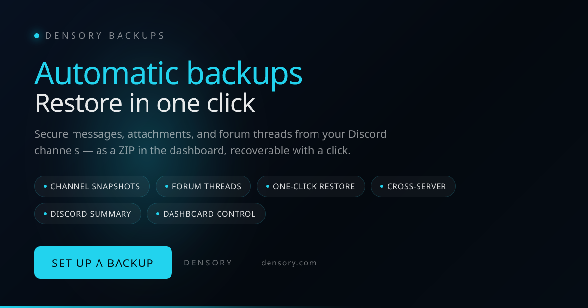

# Densory Backups — Backup & Restore

 

> Sleep more soundly — your most important channels are automatically backed up, including attachments and forum threads.

Densory Backups archives text and forum channels in the background: messages, files, embeds, and threads end up in your dashboard as searchable snapshots. If something goes wrong, you can start the restore with a click — even on a different server, with true-to-the-original author names.

### 🛒 Get it on the Densory Shop

**[Densory Backups — View in Shop](https://densory.com/shop/densory-backups)**

## Features

- **Channel Snapshots** — Text and Forum Channels — Messages, files, and embeds automatically archived.
- **Forum Threads** — Threads including metadata — not just top-level messages.
- **One-Click Restore** — Select snapshot, set target channel — even on another server.
- **Cross-Server** — Take the community archive with you when you move — true-to-the-original author names.
- **Discord Summary** — Backup ready? Summary directly as an embed in your log channel.
- **Dashboard Control** — Channels, interval and rhythm centrally configured — without bot commands.

## Prerequisites

- Discord bot with access to the channels to be secured
- Bot host with sufficient disk space
- For very large files, a boosted Discord server is recommended

## Setup

1. **Select channels**
   In the dashboard, mark the channels that matter most to you — rules, announcements, community archive.
2. **Set the rhythm**
   Choose hourly, daily, or weekly — the bot will do the rest.
3. **Have it backed up automatically**
   You will receive a clear summary directly in Discord as soon as a backup is ready.
4. **Restore when needed**
   Select snapshot, select target channel, start restore — without stress and without manual copying.

## Configuration

See the full settings reference in [docs/configuration.md](docs/configuration.md).

## Changelog

See [CHANGELOG.md](CHANGELOG.md) and the GitHub Releases tab for the full version history.

## Support & Links

- 🛒 [Shop](https://densory.com/shop/densory-backups)
- 💬 [Discord](https://densory.com/discord)
- ⚙️ [Control Center](https://densory.com/dashboard)

---

_Managed with the Densory Control Center: [https://densory.com/dashboard](https://densory.com/dashboard). Available at [https://densory.com/shop/densory-backups](https://densory.com/shop/densory-backups)._
